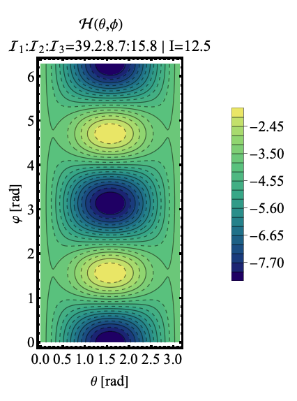

# Double Energy Shift - TSD2 & TSD4

*Double-$\epsilon$-shift*

This C++ implementation attempts at finding the best parameter set ($\mathcal{P}=[\mathcal{I}_1,\mathcal{I}_2,\mathcal{I}_3,V,\gamma]$) that minimize the root mean square error of the wobbling energies in $^{163}$Lu.

## Shifting the bands TSD2-4

Compared to the formalisms that considered the different configurations for the TSD1,2,3,4 triaxial bands (i.e. A-B formalisms), and the one that makes an upward shift in energy just for the fourth wobbling band (TSD4), in this current implementation, there will be two different upward shifts in the excitation energies for both TSD2 and TSD4.

While the energy constant which was added into the TSD4 states was due to the chiral phenomenon that takes place between the yrast band and TSD4, the constant fixed energy which will be added to TSD2 is due to the *signature nature* of the two bands.

For notation purposes, the quantity $\epsilon=(\epsilon_1,\epsilon_2)$ refers to the two upward shifts in the excitation energies for the two bands (TSD2, and TSD4, respectively). Furthermore, when mentioning $\epsilon$, both values of energy shifts are in fact considered (one can view this as a vector with two numerical components: the shift in energy associated to TSD2 and the upward shift that corresponds to TSD4).

|  AB-formalisms | 1-shift (TSD4)  | double-$\epsilon$-shift
|---|---|---|
| $\epsilon_1=0 , \epsilon_2=0$  |$\epsilon_1=0 , \epsilon_2\neq 0$   | $\epsilon_1\neq 0, \epsilon_2\neq0$|

This new approach will add more complexity in the search function for the best parameter set due to the following reasons:

1. The value of $\epsilon$ is unknown at the first $\to$ it must be added in the *search function*

2. Two different values with intervals $[\epsilon_\text{min},\epsilon_{max}]$ will introduce a higher complexity in the total `for`-loop of the algorithm: $\mathcal{O}(n_\epsilon^2)$.

3. While the two energy shifts might provide better results for the quality of the energy fit, it can also worsen the quality of the energy surface associated to the deformed system:
   1. The energy function $\mathcal{H}$ uses as input parameters the MOIs found by the fitting procedure
   2. The different rations between these parameters might lead to sub-optimal contour plots with the classical energy function
   3. `Class-A` contour plots are required for the obtained results.

Because of these reasons, it is necessary to find a way to keep the overall implementation usable from a time-execution standpoint. One way of doing this might be a reduction in the interval of the allowed values of $\mathcal{I}_k$. By reducing (or adding constraints) on the parameters, the `for`-loop can significantly be reduced in size (since the MOIs introduce a cubic complexity as of current numerical development). The reduction in the intervals for each MOI can be done by using a so-called **Class-A** rule for the contour plots.

## `Class-A` Contour Plots for $\mathcal{H}(\theta,\varphi)$

As it was already mentioned in the sections devoted to the energy function, this quantity reflects (in a classical approach) how the nucleus behaves at different *positions* in the phase space (generated by the spherical coordinates). By constructing this function from a variational principle, it is clear that $\mathcal{H} indicate the regions in which the isotope can be stable, can have a certain triaxiality, and which of the rotational states are allowed or not.

The most accurate picture for having a triaxial nucleus which *performs* wobbling motion is one that has clear trajectories (which are in fact the rotationally allowed states of $^{163}$Lu}) around minimum points (points in which the system can be found with the highest probability, since the energy of that state has a minimal value).

Example of a `Class-A` energy function/contour-plot:

❓  One can see the closed trajectories around the minimum points, located at fixed distances between each other (distance of $\pi$ in the $\varphi$ axis) but also the *almost opened* trajectories, which are the ones of interest: they indicate rotational states for a given spin at which the system changes its wobbling regime (e.g. shape transition, nuclear deformation).

⚠️ Class-A contour plots are obtained for only some values of the moments of inertia. Finding the intervals for such values (also called `class-A` MOIs) is the main task devoted to the Mathematica implementation which creates contour plots.

**Observation**: Obtaining new class-A MOIs needs to be consistent with the overall goal of the project, which is to have a good agreement with experimental values concerning wobbling spectrum $\to$ 
***The quality of the excited spectrum must not be affected by the `class-A`+`double-shift` (combined) approaches.***

After the newly determined class-A MOIs are found, the straightforward implementation of the fit can be performed.
