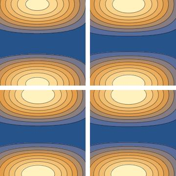
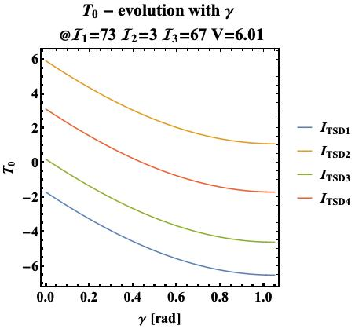

# The energy function of $^{163}$Lu

The current project must also compute the energy function of this nucleus, in terms of its spherical components (that are replaced in the expressions of the angular momentum components).

The energy function represents the evolution of the minimum energy points with respect to different values of spin $I$, but also the relevant deformation parameters (e.g. the parameter set used in calculating the `rms`).

Expression for the energy function $\mathcal{H}$ is given below (initial calculations done by Raduta in [this document](Reports/HLu163.pdf)):

$$\mathcal{H}=\frac{I}{2}(A_1+A_2)+A_3I^2+I(I-\frac{1}{2})\sin^2\theta(A_1\cos^2\varphi+A_2\sin^2\varphi-A_3)+\\+\frac{j}{2}(A_2+A_3)+A_1j^2-2A_1Ij\sin\theta-V\frac{2j-1}{j+1}\sin(\gamma+\frac{\pi}{6})$$\

This energy function is computed by replacing in the original structure of $\mathcal{H}$ the coordinates $(\psi,t)$ with $(0,j)$ and the term $r=I(1+\cos\theta)$.

*Original expression of the energy function (given in [this article](/Reports/Towards%20a%20new%20semi-classical%20interpretation%20of%20the%20wobbling%20motion%20in%20163Lu.pdf)).*


## Contour Plot

The contour plot for $^{163}$Lu has been calculated within the Mathematica document `EnergyFunction.nb` (dedicated to solve the main problem). For a fixed value of spin, and arbitrary test parameters, the output file can be seen in the graphical representation shown below.



## Study of the energy function with respect to the spherical variables

* The energy $\mathcal{H}$ is evaluated at changes in both the coordinates $(\theta,\varphi)$, but also the fit parameters (deformation parameters).
* This function has free terms and coordinate-dependent terms.
* Evolution with a change in *free terms* indicate the minimum value of $\mathcal{H}$.
* Understanding the smallness of the mixed terms could indicate if the function has stable points (or trajectories) around global minima (m) or maxima (M).

### Evolution of the free term $T_0$

The free term has the following expression:

```
t0[I_, j_, a1_, a2_, a3_, V_, \[Gamma]_] := 
  I/2 (a1 + a2) + a3*I^2 + j/2 (a2 + a3) + a1*j^2 - 
   V (2 j - 1)/(j + 1) Sin[\[Gamma] + \[Pi]/6];
```

The triaxiality parameter $\gamma$ and the single-particle potential strength $V$ enter in the expression of $T_0$. Due to this, two separate evolutions of $T_0$ should be done, at fixed moments of inertia: one w.r.t. $\gamma$ and one w.r.t. $V$.

#### Free term - evolution with $\gamma$

The inertial parameters are fixed, together with $V$. These values are obtained from the fitting procedure part. In this study, $\gamma$ varies inside: $[0,\frac{\pi}{6}]$.



#### Free term - evolution with $V$

The inertial parameters are fixed, together with $\gamma$. These values are obtained from the fitting procedure part. In this study, $V$ varies inside: $[0,10]$.


