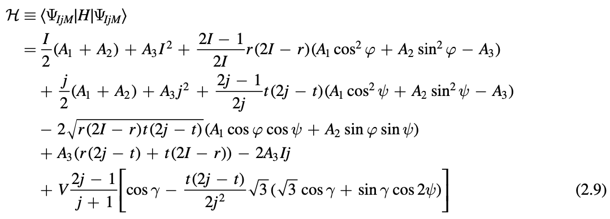
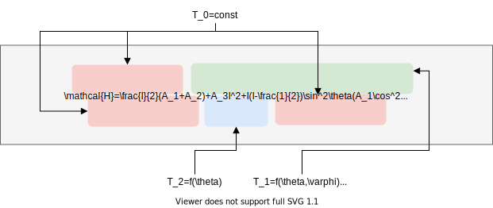
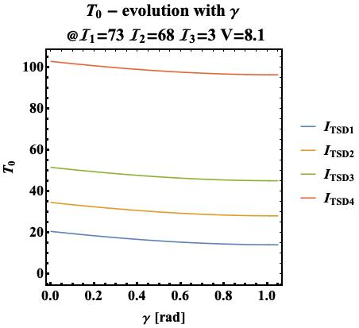
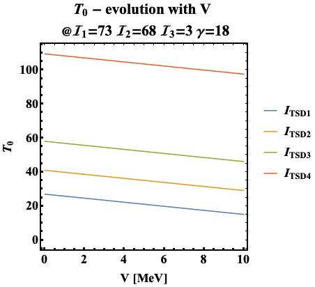
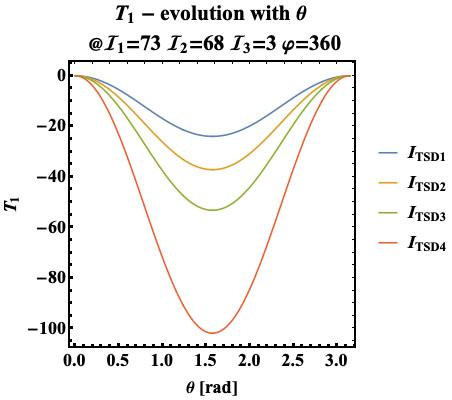
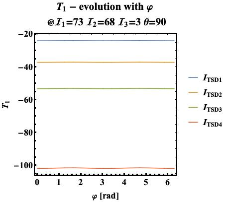
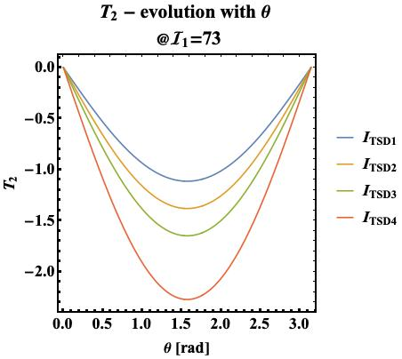
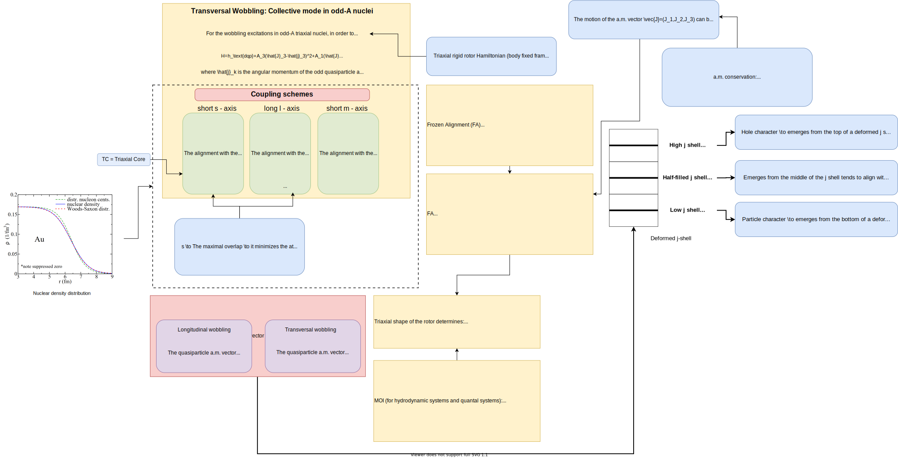
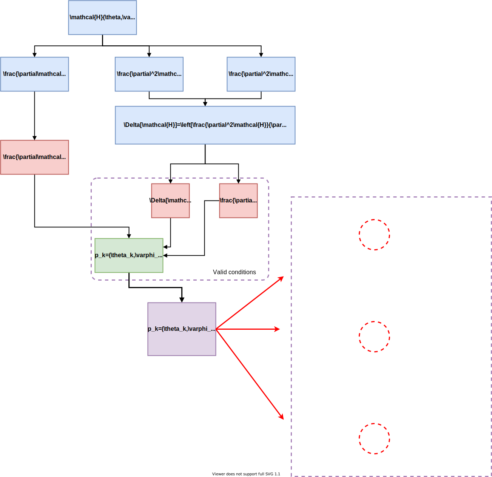
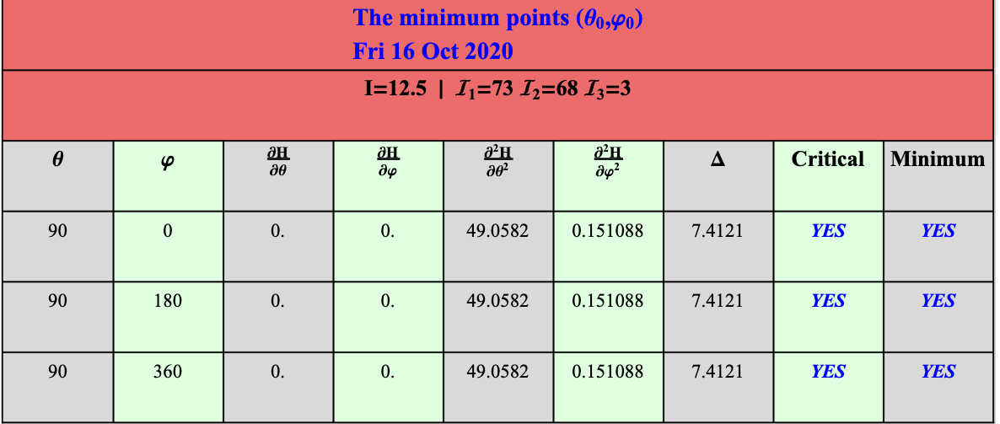

# The energy function of $^{163}$Lu

Another focus of this project is to find the energy function associated with the triaxial nucleus, function which describes the rotational behavior or can even indicate shape transitions and speculate on the actual wobbling regime that takes place in the nucleus at a given spin value.

## Classical equations

The way in which this function is obtained comes from a classical approach: from the quantal space, a transition to the classical phase space is done by a *dequantization* procedure, in which the quantum operators become *classical coordinates* (e.g. classical momentum operator and classical position operators, which are canonical variables). Moreover, by a change of variables (fully described starting with [section 2](Resources/Documentation/Raduta_2018_J._Phys._G__Nucl._Part._Phys._45_105104.pdf)) of this work), one can obtain classical equations of motion and those are brought to a canonical form through a *variational principle* type of equation.

The average of the Hamiltonian $\hat{H}$ with the trial function used for solving the variational principle $|\Psi_{IjM}\rangle$ is denoted by $\mathcal{H}$ and it represents in fact the classical energy, with the expression given in the same work:



## Spherical coordinates $\theta$, $\varphi$

However, the energy function can also be expressed in terms of the spherical coordinates $\theta$ and $\varphi$, which can be extracted from the representation of the angular momentum vector $\vec{I}$ and its components $(x,y,z)$.
The energy function represents the evolution of the nuclear surface, and its stability points (from an energetic standpoint) with respect to different values of spin $I$, but also to the relevant deformation parameters (e.g. the ones used in calculating the `rms`).

Expression for the energy function $\mathcal{H}$ is given below (initial calculations done by Raduta in [this document](Resources/Documentation/HLu163.pdf)):

$$\mathcal{H}=\frac{I}{2}(A_1+A_2)+A_3I^2+I(I-\frac{1}{2})\sin^2\theta(A_1\cos^2\varphi+A_2\sin^2\varphi-A_3)+\frac{j}{2}(A_2+A_3)+A_1j^2-2A_1Ij\sin\theta-V\frac{2j-1}{j+1}\sin(\gamma+\frac{\pi}{6})$$

This energy function is computed by replacing in the original structure of $\mathcal{H}$,  the coordinates $(\psi,t)$ with $(0,j)$ and the term $r=I(1+\cos\theta)$.

*Original expression of the energy function (given in [this article](Towards%20a%20new%20semi-classical%20interpretation%20of%20the%20wobbling%20motion%20in%20163Lu.pdf)).*


## Contour Plot

Once the energy function is analytically determined via its spherical coordinates and the parameter set (denoted from now on with $\mathcal{P}$), it is possible to obtain numerical values for $\mathcal{H}$ across the entire interval of values for $(\theta,\varphi)$. Representing the numerical values (evaluated at a given angular momentum, moments of inertia, single particle deformation and triaxiality parameter) can be done in a graphical manner via a **contour plot**, which will give the change in energy with respect to the components of the angular momentum.

The contour plot for $^{163}$Lu has been calculated within the Mathematica document `EnergyFunction.nb` (dedicated to solve the main problem). For a given parameter set $$\mathcal{P}=[I,\mathcal{I}_1,\mathcal{I}_2,\mathcal{I}_3,V,\gamma]$$, the implementation performs several contour plots, (depending on the chosen spins associated to each band - bringing the number of graphical representations to correspond with the number of triaxially superdeformed (TSD) bands in the wobbling spectrum of $^{163}$Lu) that are exported via the `Export[path,object]`
to the project tree.

Below, there are some contour plots (made with the [latest implementation](Code/Math/Energy_Function_MOI_Evolution.nb) that was developed within [this commit](https://github.com/basavyr/163Lu-New-TSD4-Formalism/commit/60f747b5d241cf2406d5876ec83ad94ed3a5d215)) that aim at representing how the nuclear stability takes places w.r.t. the total angular momenta, for the moments of inertia which are considered as *effective MOIs* in $^{163}$Lu, across the entire wobbling spectrum.

## Evolution with respect to the overall triaxiality effect in $^{163}$Lu

The largest moment of inertia is across the 1-axis, and the other two being oriented across 2-axis and 3-axis, respectively, but with smaller values, and different between each other (hence the triaxial effects that take place).

However, within the nucleus, there can be several causes that might change its orientation, its shape, its rotational motion (e.g. collective effects due to polarization of the core, phenomena discussed [here](Resources/Documentation/Towards%20a%20new%20semi-classical%20interpretation%20of%20the%20wobbling%20motion%20in%20163Lu.pdf)), and these can lead to changes in the values of the moments of inertia. Due to this particular reason, it is useful to get an insight on the actual change of $\mathcal{H}$ then 2- and 3- axis's moments of inertia suffer an increase in their effective value. 

This can be seen in the plots shown below, in which indeed, a contour plot is represented at each snapshot (fixed deformation parameters), but with an evolution associated to the secondary axes towards high values in their moment of inertia (starting from low values of $\mathcal{I}_{2,3}\approx3$ and going up to the maximal allowed value of $\mathcal{I}_1$).

Evolution of the 2-axis w.r..t other two


Evolution of the 3-axis w.r..t other two


> It is worth mentioning that the parameters chosen in the above contour plots were fixed from calculations performed by Raduta's method ***double-energy-shift-fit*** which will be described in detail in one of the following sections. The fit parameters used in this calculations provide the best results which confirm the wobbling spectrum of the isotope.

## Study of the energy function with respect to the spherical variables

* The energy $\mathcal{H}$ is evaluated with respect to a change in both the coordinates $(\theta,\varphi)$, but also to a change in the fit parameters (*deformation parameters*).
* This function has free terms, one mixed coordinate term (function of both $\theta$ and $\varphi$) and one which solely depends on $\theta$.
* Evolution of the energy function with a change in the *free terms* magnitude might indicate the absolute minimum value that the nuclear system can have.
* Understanding the smallness of the mixed terms could indicate if the function has stable points (or trajectories)      around global minima (m) or maxima (M).
* The terms are denoted as in the diagram shown below.



> ⚠️ **Observation**: In the following section, the calculations were performed in the so-called *minimum points* of the energy function, namely, those points $p_k=(\theta_k,\varphi_k)$ which minimize the value of $\mathcal{H}$ for a particular set of deformation parameters $\mathcal{P}$.

The numerical values for the parameter set was obtained from Raduta's calculations which implied fitting the excitation energies of all four TSD bands, but with two *energetic shifts* in the TSD2 and TSD4 (i.e. the excitation energies in these two bands were shifted upwards by some fixed values that arise from theoretical aspects regarding the signature/chiral concepts).
Discussion about minimizing the energy function, finding its critical points, and extreme points will be done within the following sections.

### Evolution of the free term $T_0$

The free term has the following expression:

```
t0[I_, j_, a1_, a2_, a3_, V_, \[Gamma]_] := 
  I/2 (a1 + a2) + a3*I^2 + j/2 (a2 + a3) + a1*j^2 - 
   V (2 j - 1)/(j + 1) Sin[\[Gamma] + \[Pi]/6];
```

The triaxiality parameter $\gamma$ and the single-particle potential strength $V$ enter in the expression of $T_0$. Due to this, two separate evolutions of $T_0$ should be done, at fixed moments of inertia: one w.r.t. $\gamma$ and one w.r.t. $V$.

#### Free term - evolution with $\gamma$

The inertial parameters are fixed, together with $V$. These values are obtained from the fitting procedure part. In this study, $\gamma$ varies inside: $[0,\frac{\pi}{6}]$.



#### Free term - evolution with $V$

The inertial parameters are fixed, together with $\gamma$. These values are obtained from the fitting procedure part. In this study, $V$ varies inside: $[0,10]$.



### Evolution of $T_1$

This is a mixed term. Depends on both coordinates. The minimum point has been chosen $p_0=(\pi/2,2\pi)$.

#### $T_1$ as a function of $\theta$



#### $T_1$ as a function of $\varphi$



### Evolution of $T_2$

This term only contains the $\theta$ coordinate.

#### $T_2$ evolution with $\theta$



## Python vs. Mathematica

A `python` implementation was also made for testing the correctness of the Mathematica developed algorithm. There is a consistency between both implementations.

```Mathematica
Do[Print[th, " ", Hen[spinTSD1, \[Pi]/2, th, A1, A2, A3, V, \[Gamma]]], {th, {0, \[Pi]/4, \[Pi]/2, \[Pi]}}]
```

```text
0 -5.57223

\[Pi]/4 6.41407

\[Pi]/2 18.4004

\[Pi] -5.57223
```

These values correspond to the numerical results printed via python within this segment of [py3-impl](Code/Python/EnergyFunction.py).

```py
phi_test_values=[0,np.pi/4.0,np.pi/2.0,np.pi]
for fi in phi_test_values:
    print(H_En(SPINS[0],CONSTANTS[0],CONSTANTS[1],CONSTANTS[2],CONSTANTS[3],CONSTANTS[4],np.pi/2,fi))
```

## Contour plot of the energy function

The contour plot for the energy function, which represents its numerical change with respect the the spherical coordinates $\theta, \varphi$ is a critical part of this work, since it might provide information with nuclear shape transitions (when the angular momentum changes its value), the wobbling regime (wether it is *longitudinal* or *transverse*).

### Wobbling regimes in nuclei

It is well-known from the work of Frauendorf et al [^1] that there can be two types of wobbling motions inside a triaxial nucleus: namely the *longitudinal motion*, when the single-particle angular momentum couples (aligns) along the axis with the intermediate moment of inertia, and *transverse motion*, in which the odd-particle's angular momentum aligns perpendicular with the $m$-axis. A detailed view can be seen in the following diagram:



> It is important to notice that for a triaxial rigid rotator, the intermediate axis has the largest moment of inertia.

By obtaining a consistent graphical representation with the change in the energy of the nuclear surface (by surface, one considers the fact that the classical energy function obtained by expanding the Hamiltonian around the stability points, thus obtaining the classical equation that dictates the possible states of nuclear stability/existence), it is possible to give a conclusion on wether the isotope is of transverse type or longitudinal type.

There is a [Mathematica implementation](Code/Math/Energy_Function_MOI_Evolution.nb) which focuses on computing the numerical values for the energy function (function arguments being the spherical coordinates) for a given set of deformation parameters, and then perform the contour plots. Proper workflow is given in the diagram attached below.

**The general workflow of the Mathematica implementation for obtaining a graphical representation with the *energy surface***


## Analysis of the energy surface of $^{163}$Lu

The $\mathcal{H}$ quantity can show the stability regions where transverse/longitudinal wobbling might take place, at different spin values $I$. It is also necessary to study which of the regions across the $\theta-varphi$ plane have trajectories around **minimum points**, since those trajectories represent in fact the possible rotational states of the nucleus at different spins and deformation parameters.

As a result, on this section, a complete description on how the minimum points $p^\text{min}_k$ are computed and also graphically represented alongside the contours. In addition, table views with the minimum points for each spin value are exported from Mathematica. Having the numerical values for a direct comparison with C++ numerical implementations is a useful procedure.

**Goals**:

1. Find the **critical points** of $\mathcal{H}$:
   1. Find (analytical) expressions for the 1st order partial derivatives of $\mathcal{H}$, namely:
   $$\left(\frac{\partial \mathcal{H}}{\partial \theta}\ ,\ \frac{\partial \mathcal{H}}{\partial \varphi}\right)$$
   2. Find (analytical) expressions for the 2nd order partial derivatives of $\mathcal{H}$, namely:
   $$\left(\frac{\partial^2 \mathcal{H}}{\partial \theta^2}\ ,\ \frac{\partial^2 \mathcal{H}}{\partial \varphi^2}\right)$$
   3. Construct the mixed derivative of $\mathcal{H}$.
   4. Construct the **discriminant operator**: $$\Delta(\mathcal{H})=\text{(product 2nd order p.d.s)}-(\text{mixed derivative of H})^2$$

ℹ️ These steps are required in order to find the possible candidates for minimum points of the energy function. More information on how one can compute/find the critical points of a multi-variable function (points in which the function itself has a null first-order partial) can be found in [this 📝 document](Resources/Documentation/13.7__Extreme_Values_and_Saddle_Points.pdf). 

2. Find the **minimum points** of $\mathcal{H}$: Once the critical points have been identified (for the entire interval of values $\theta$ and $\varphi$), there are just two straightforward conditions which need ot be checked by the point $p_\text{critical}=(\theta_c,\varphi_c)$. According to the cited document above, the conditions are:
   1. **Positive** *discriminant* of $\mathcal{H}$ in that point.
   2. **Positive** 2nd order partial derivative w.r.t. $\theta$.

The Mathematica implementation (finished within [this project commit](https://github.com/basavyr/163Lu-New-TSD4-Formalism/commit/60f747b5d241cf2406d5876ec83ad94ed3a5d215)) attempts at checking the necessary conditions for critical and then minimal points by taking values of $\theta$ and $\varphi$ with a step of 10$^o$ on each iteration. The valid points are saved into a list, then exported into a tabular form, but also as `Graphics` objects which will be represented together with the contour plot, in order to have a proper identification of the trajectories around the marked points.

Such a workflow is shown in the diagram below.



### Tabular form with the minimum points

Below there is a table with all the minimum points found by the algorithm, using a predefined set of MOIs and fit parameters.


There is also a table with all the partial derivatives for a given set of parameters and spin. File can be accessed [here](Resources/Output_Data/Energy_Function/H_Partials.pdf).

[^1]: Frauendorf, S., & Dönau, F. (2014). Transverse wobbling: A collective mode in odd-<span class="aps-inline-formula"><math><mi>A</mi></math></span> triaxial nuclei. Phys. Rev. C. https://doi.org/10.1103/PhysRevC.89.014322