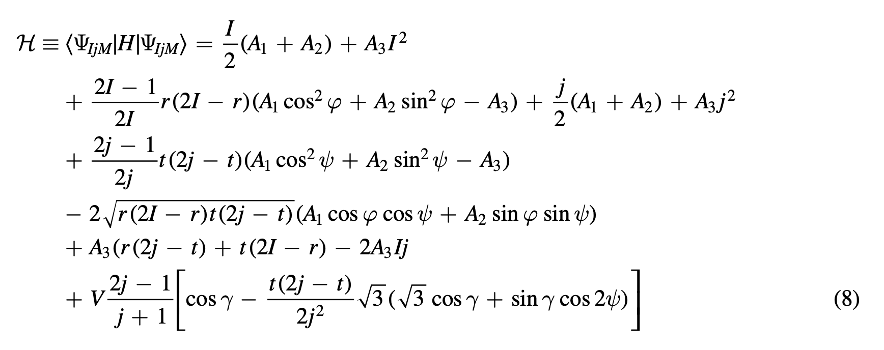

# The energy function of $^{163}$Lu

The current project must also compute the energy function of this nucleus, in terms of its spherical components (that are replaced in the expressions of the angular momentum components).

The energy function represents the evolution of the minimum energy points with respect to different values of spin $I$, but also the relevant deformation parameters (e.g. the parameter set used in calculating the `rms`).

Expression for the energy function $\mathcal{H}$ is given below (initial calculations done by Raduta in [this document](Reports/HLu163.pdf)):

$$\mathcal{H}=\frac{I}{2}(A_1+A_2)+A_3I^2+I(I-\frac{1}{2})\sin^2\theta(A_1\cos^2\varphi+A_2\sin^2\varphi-A_3)+\\+\frac{j}{2}(A_2+A_3)+A_1j^2-2A_1Ij\sin\theta-V\frac{2j-1}{j+1}\sin(\gamma+\frac{\pi}{6})$$\

This energy function is computed by replacing in the original structure of $\mathcal{H}$ the coordinates $(\psi,t)$ with $(0,j)$ and the term $r=I(1+\cos\theta)$.

*Original expression of the energy function (given in [this article](/Reports/Towards%20a%20new%20semi-classical%20interpretation%20of%20the%20wobbling%20motion%20in%20163Lu.pdf)).*

