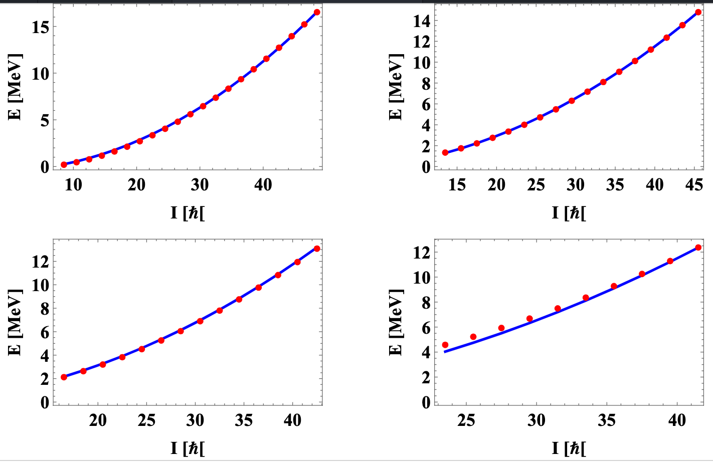
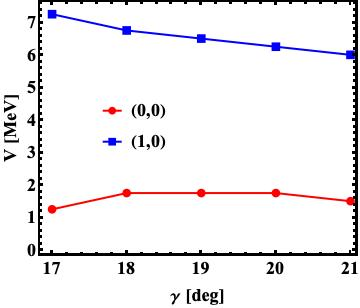
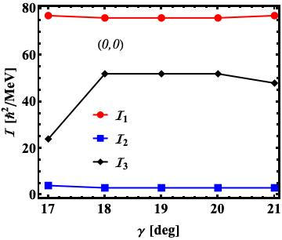
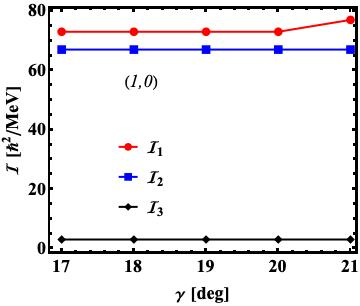
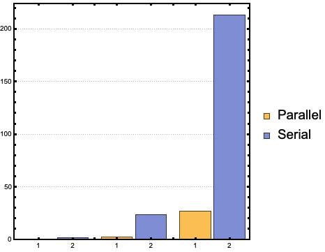
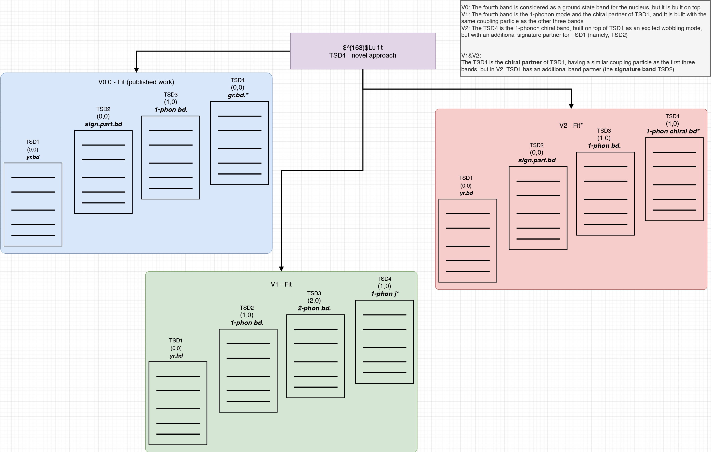

# $^{163}$Lu - Excitation energies
## New approach for TSD4 structure

Project which aims at computing the excitation energies for the wobbling spectrum of $^{163}$Lu using a novel approach for the TSD4 band.

The nucleus $^{163}$Lu has four wobbling bands (including the yrast TSD1) and the excitation spectrum has a rich structure. Each band (denoted by TSD1,2,3, and 4, respectively) has a certain number of *spin states*, with a definite energy for each state.

So far, the calculations involving *wobbling spectrum* of this nucleus were made with the fourth band considered as the coupling of an even-even core with an odd-$j$ particle (the $h=\pi_{11/2}$ *intruder* proton). However, this current approach will consider the fourth band (*three-phonon wobbling band*) as a collection of states with definite energies, but the coupling an odd-$j$ particle will be detached (no more coupling: **the spins in this band will be equivalent to the spin of the core itself**).

___

Main goals of the present project are:

- [ ] Obtain the analytic formulas for the four excited **wobbling bands** in $^{163}$Lu.
- [ ] Write the experimental data set with the known spins and excitation energies for each band.
- [ ] **New formalism**: The spins for the fourth band (namely, TSD4) will represent the values of the *core*, and not the total particle-rotor model (no core+odd-particle coupling).
- [ ] Define the free parameter set which enters in the energy formulas.
- [ ] Compute the RMS of the excitation energies of all the bands w.r.t. to a parameter set $P$.
- [ ] Find the parameter set $P_m$ which provides the best RMS value.

## Preliminary results

Key features of the current implementation:

* uses a global array as the container to store the values of the theoretical energies.
  * In this way, re-allocation of the list with each iteration in the rms-search-loop is avoided
  * The time execution of the entire process(as well as the memory pressure on the actual machine) is much more optimal rather than the previous version, where a new array was initialized within each main iteration.
* uses small steps for the fit parameters (`I_step=1`)
* uses fixed $\gamma$: only four values (close to the experimental value $\gamma_{exp}=17$) are considered in the 
* the rms implementation has proper stopping procedures in case the theoretical values are non-physical numbers.
* priority for $\mathcal{I}_1$ maximal MOI is introduced into the fit. 
* special condition for triaxial MOIs
* two formalisms for TSD4 are considered into the fit procedure:
  * TSD4: $(n_{w_1},n_{w_2})=(0,0)$
  * TSD4: $(n_{w_1},n_{w_2})=(1,0)$
* other fixed parameters: $j=13/2$

## Fit results

### TSD4: $(n_{w_1},n_{w_2})=(1,0)$

```
##########################
I1= 73
I2= 3
I3= 67
V= 6.01
gamma= 21
E_RMS= 0.143092
##########################
```



## Analysis of the potential strength parameter $V$

In this plot, the *single particle potential strength* ($V$) is graphically represented with respect to the triaxiality parameter $\gamma$.

The fourth band has two possible formalisms in the analytic calculations (namely, a ground state band given by the phonon numbers $(0,0)$ and a 1-phonon excited band built on top of the yrast band $(1,0)$).



## Analysis of the MOI evolution with triaxiality parameter

The moments of inertia for $^{163}$Lu are represented for each value of $\gamma$ that was included in the fitting procedure.

The evolution of the MOI's are considered for both analytic formalisms regarding the expression of TSD4.





## Serial vs. Parallel implementation

In the latest project update [](), the search function for the energy's root mean square error is computed in a multi-threaded approach, using the `openMP` standard for computing the RMS value for different values of the triaxiality parameter $\gamma$ at the same time. This considerably reduces the computational runtime (check image below), where the execution time increases with the decrease in the step for the moment of inertia $\mathcal{I}$.

(In the figure below, the step sizes are as follow: 20, 10, 5,respectively.)



## Further analysis with regards to the nuclear stability of $^{163}Lu

The nucleus is analyzed in terms of its critical points, or the regions where the deformed shapes exhibit certain properties (e.g. different wobbling regimes, axial symmetry, forbidden states).
___
> **More information with regards to this part of the project can be seen [here](EnergyFunction.md).**
___
This project is introduced in the following [issue](https://github.com/basavyr/163Lu-New-TSD4-Formalism/issues/5).

## The signature partner approach

In [a different project](https://journals.aps.org/prc/abstract/10.1103/PhysRevC.101.014302), the wobbling energies for $^{163}$Lu were calculated using the TSD2 as a non-phonon excitation, but rather the **signature partnter** of the yrast band TSD1.
Also, the fourth band TSD4 was considered a ground state band for the same nucleus, but built on a different coupling (with different intruder particle).

Now, the second approach which aims at giving a good description for the wobbling motion inside this nucleus will be the combination of the already published work (mentioned above) and the current fit procedure which had the results described in the previous sections. more precisely:

* The TSD2 is a signature partner for TSD1, and it is a zero-phonon-mode wobbling band for $^{163}$Lu.
* TSD3 is the 1-phonon mode built on top of TSD2.
* TSD4 is the 0( or 1)-phonon mode built on TSD1, being the **chiral partner** of TSD1.

(More details on this [Roam document](https://roamresearch.com/#/app/basavyr/page/xf-zGkA_-))

The diagram below describes the two fitting approaches that are present in this project: **V1** and **V2**.

* V1: The first part of this project, which has already obtained an `RMS` value, with fit parameters.
* V2: The newly proposed project, in which the definition of the TSD2 and TSD3 will be adjusted accordingly.

*See the diagram in full quality [here](Reports/TSD4_novelApproach_description.pdf).*

