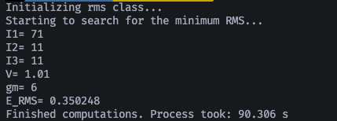
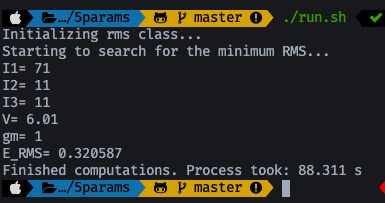

# $^{163}$Lu - Excitation energies
## New approach for TSD4 structure

Project which aims at computing the excitation energies for the wobbling spectrum of $^{163}$Lu using a novel approach for the TSD4 band.

The nucleus $^{163}$Lu has four wobbling bands (including the yrast TSD1) and the excitation spectrum has a rich structure. Each band (denoted by TSD1,2,3, and 4, respectively) has a certain number of *spin states*, with a definite energy for each state.

So far, the calculations involving *wobbling spectrum* of this nucleus were made with the fourth band considered as the coupling of an even-even core with an odd-$j$ particle (the $h=\pi_{11/2}$ *intruder* proton). However, this current approach will consider the fourth band (*three-phonon wobbling band*) as a collection of states with definite energies, but the coupling an odd-$j$ particle will be detached (no more coupling: **the spins in this band will be equivalent to the spin of the core itself**).

___

Main goals of the present project are:

- [ ] Obtain the analytic formulas for the four excited **wobbling bands** in $^{163}$Lu.
- [ ] Write the experimental data set with the known spins and excitation energies for each band.
- [ ] **New formalism**: The spins for the fourth band (namely, TSD4) will represent the values of the *core*, and not the total particle-rotor model (no core+odd-particle coupling).
- [ ] Define the free parameter set which enters in the energy formulas.
- [ ] Compute the RMS of the excitation energies of all the bands w.r.t. to a parameter set $P$.
- [ ] Find the parameter set $P_m$ which provides the best RMS value.

## Initial test run

August 2020:

The algorithm is using large parameter steps, so accuracy is lost.

Update on the algorithm with optimized computations.

