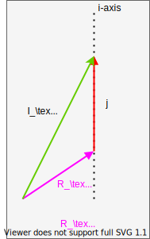

# $^{163}$Lu - Wobbling Motion & Energy Spectrum

## Theoretical Aspects Regarding Wobbling Motion in $^{163}$Lu

Wobbling motion plays an important role in determining which nuclei have stable structures with very large deformation (e.g. high degree of asymmetry in their mass/charge distribution, large quadrupole moments, rich energy spectra and increased ratios between the moments of inertia - giving triaxial parameters with interesting values).

Being a unique fingerprint for identifying triaxial nuclei with strong deformation (phenomenon which helps the nuclear physics community in topics like fission barrier heights, proton emission probabilities, nucleon separation energies) it has become a very interesting topic for both experimentalists and theoreticians. However, understanding and obtaining a full picture for this effect is definitely now an easy task.

The present project aims at developing *a new approach in describing the nuclear properties of $^{163}$Lu* isotope (considered to be one of the best *wobblers* know so far). The features of wobbling motion (phenomenon strictly related to stability of highly deformed nuclear shapes) that are present in the nucleus under study have a strong experimental foundation, with excitation energies, transition probabilities, quadrupole moments and so on, determined within high degrees of accuracy. Based on an increasing number of contributions from the nuclear structure community, the concept of wobbling motion (with its main characteristics, features and physical significance) is an established phenomena from a theoretical standpoint, especially in the nuclear region $A\approx160$.

> Find an in-depth analysis of the project [here](Resources/Reports/Lu163_newFormalism.pdf)

The wobbling spectrum of $^{163}$Lu has four known wobbling bands (w.b.) which were confirmed experimentally, with well defined spins, energies and quadrupole moments. The available data for this nucleus can be accessed [here](Resources/Documentation/experimental_data_ensdf.pdf).
So far, the spectrum was regarded as having a standard *harmonic-like* structure, with a ground state band (a zero phonon mode of the nucleus) and three additional bands built on top of it (one, two and three-phonon modes of excitation). The nomenclature of this nucleus's wobbling structure is as follows:

* TSD1 is the yrast band, ground state for the wobbling spectrum, with the phonon wobbling numbers: $(n_{w_1},n_{w_2})=(0,0)$
* TSD2 is the 1-phonon band band, built on top of TSD1, with a spin sequence that has $\Delta I=2\hbar$:  $(n_{w_1},n_{w_2})=(1,0)$
* TSD3 is the second excited wobbling band (2-phonon w.b.): $(n_{w_1},n_{w_2})=(2,0)$
* TSD4 is the third excited w.b., built on top of TSD1 with three wobbling phonons: $(n_{w_1},n_{w_2})=(3,0)$

> This is the standard picture for the wobbling spectrum fo $^{163}$Lu nucleus, in which the concept of wobbling motion is described through phonon excitations that are used to build sequences of $\Delta=2\hbar$ spin states.

Main goals of the present project are:

- [ ] Obtain the analytic formulas for the four **wobbling bands** in $^{163}$Lu.
- [ ] Define the free parameter set which enters in the energy formulas: $\mathcal{P}$.
- [ ] Implement methods for computing each energy band of the nucleus, then also compute root mean square error (`rms`) for the excitation energies, based on the experimental data.

$$E_\text{RMS}=\sqrt{\frac{\sum(E_{exp}-E_{th})^2}{N}}$$
with $E_\text{th}$ being a numerical function (which should be implemented) that depends on the spins and the parameter set: $E=f(I,\mathcal{P})$.

- [ ] **NEW APPROACH**: Instead of using the band structure described at the beginning, this project considers **two** new approaches, which could prove to be more efficient tool for studying the wobbling motion. Description of the two approaches (namely **A** and **B** is found below).
  * The theoretical model on which the approaches are based goes further than the present frameworks. Phenomena like *chiral symmetry* and *signature splitting* could actually take place in the underlying physics of the shape structure of $^{163}$Lu.
  * Semiclassical manner of treatment is helping the theory due to its close contact with the motion of well know physical systems (e.g. rigid rotor, particle rotor model).
  * The mathematical framework that is developed towards obtaining the excited wobbling spectrum and transition probabilities encapsulates some interesting features (e.g. obtaining real solutions for non-hermitic Hamiltonians, wave-functions that neglect core-valence nucleon interaction).
- [ ] Implementation of a *search function*, which is looking for the best possible parameter set $\mathcal{P}_\text{best}$ that would provide minimal deviations of the excitation energies $E_\text{exc;TH}$ from the experimental ones.
- [ ] Search function should compute the `rms` for every interval of existence for the following *free parameters*:
  * Moments of inertia (w.r.t. the principal planes): $\mathcal{I}_1$, $\mathcal{I}_2$, $\mathcal{I}_3$.
  * Triaxiality parameter: $\gamma$.
  * The single particle potential strength: $V$.
  * The core-$\vec{j}$ coupling (valence particle + triaxially deformed even-even core) is consistent across all four bands: the valence proton (intruder) $\pi_{i;j=13/2}$ is the particle with couples to the deformed even-even core, driving the entire system up to large deformations, stable in their nature.

**Additional objectives**

- [ ] Calculation of the *Energy Function* $\mathcal{H}(\theta,\varphi)$ in terms of the spherical coordinates.
- [ ] The spherical coordinates are obtained from the components of the angular momentum vector $(I_1,I_2,I_3)$ expressed in polar coordinates with a fixed magnitude $I$; $r$.
- [ ] Create contour plots with the energy function $\mathcal{H}$, evaluated at a fixed spin value $I$, single particle a.m. $|\vec{j}|=13/2$ and deformation parameters which are obtained from the least-squares fit implementation for each approach.

*A separate section is dedicated to the study of the energy function, the numerical implementations (done with the help of Mathematica) and graphical representations which are obtained.*

## Novel Formalism in Obtaining the Wobbling Spectrum

### Understanding the nature of the band structure in $^{163}Lu

As it was already mentioned, the nucleus is considered to have a harmonic-like structure for the four known wobbling bands (w.b.). The phonon numbers are increasing by one unit for each band (i.e. from 0 for TSD1, up to 3 for TSD4). However, it is important to mention that the fourth band is different from the other three, by the coupling scheme implied by the total system (core+particle). More precisely, the TSD4 band is has states that are excited due to the *coupling of the core with a different proton*: $\pi_{h;j=9/2}$ and as a result, this drives the system up to large deformations, with different quadrupole moments (in magnitude) but also negative parity (as opposed to the first three bands, where the parity is positive).

Large number of publications adopted this scheme in the theoretical formalism. Even our team developed work for reproducing the experimental results within semi-classical approaches using this formalism. (E.g. [this paper on the same isotope](https://journals.aps.org/prc/abstract/10.1103/PhysRevC.96.054320)). So far, it has been established that $^{163}$Lu is based on three excited wobbling-like bands and two different nucleon-core coupling take place in driving this to nuclear shapes with very large deformation.

However, one cannot know for sure if indeed this is the actual configuration for this isotope, since different frameworks use different concepts in describing the underlying physics that takes place when complex systems (like an even-odd nuclear body) is also under strong deformation effects, rotational motion up to very large spin and large asymmetry in the mass distribution. It is mandatory to ask ourselves if it is not possible that some other phenomena can take place at these properties. **This is the motivation for developing the current project**: the team is trying to provide an alternative view in the band structure of this nucleus, while keeping a consistent theory and give qualitative studies with regards to the relevant nuclear quantities.

> This project provides an unique description of the wobbling spectra in $^{163}$Lu, which has not been previously discussed, analyzed or even speculated. The developed description, which completely changes the way on how one considers the band structure to look like, while providing an overall agreement with the experimental results and a consistent physical model as framework.

### A-Formalism

This formalism is based on mostly the same agreement with the existent knowledge with regards to the band structure of $^{163}$Lu, the key difference being on how one regards the fourth excited band in the wobbling spectrum. In a previous work (i.e. [this](https://journals.aps.org/prc/abstract/10.1103/PhysRevC.101.014302) and [this](https://iopscience.iop.org/article/10.1088/1361-6471/ab5ae4/meta)), we considered the possibility that the fourth band could be the ground state which is built on a difference coupling scheme, with a different sequence of states for the core $R$. This argument is backed up by the fact that in the model, one regards the strong polarization effects induced by the core-$\vec{j}$ coupling different from the other three bands, which could lead to a completely different *wobbling picture*. As a result, within those calculations, the least squares fit method was applied separately for the first three bands and then TSD4. Different set of parameters were obtained with a good agreement between the theoretical results and the experimental data.

Taking this approach even further, one could try to speculate on whether the coupling scheme of TSD4 is indeed the same as the one for TSD1, since it is possible that TSD4 is its **chiral partner**. (As a reminder, a key feature of the work cited in the above paragraph is that the second wobbling band is in fact the *signature partner* of TSD1, since the potential well is very deep, and it could contain both states). **Taking the same coupling particle in TSD4 as for the other three bands would employ that they share more properties**. This allows one to consider that indeed a chiral splitting near TSD4 deformation region could take place, creating a chiral partner for TSD1. The mentioned work kept the different coupling nucleon for TSD4 ($j=9/2$, giving a weak argument on why the fourth band could be a chiral partner of TSD1).

In conclusion, **Formalism A** is just a slight modification of the well known band scheme for $^{163}$Lu, but with an adjustment on how one should consider the fourth band TSD4:
 
* same valence nucleon (the proton $j=13/2$) couples to the deformed even-even core as for TSD1,2,3. (In the cited work, the coupling for TSD4 was different due to an odd core $R$ spin sequence and $j$-orbital).
* TSD4 is the chiral partner of TSD1.
* the wobbling phonon number can have **two** possible values, namely 0 or 1 (therefore, this project denotes the A Formalism as):
  * **A1 Approach**: TSD1,2,3,4: $(0,0),(0,0),(1,0),(0,0)$.
  * **A2 Approach**: TSD1,2,3,4: $(0,0),(0,0),(1,0),(1,0)$.

*Diagram which attempts at giving an overall scheme of the A formalism can be found below.*


### B-Formalism

In a previous work (i.e. [this](https://journals.aps.org/prc/abstract/10.1103/PhysRevC.101.014302) and [this](https://iopscience.iop.org/article/10.1088/1361-6471/ab5ae4/meta)), the team adopted a different view for the wobbling picture: in comparison with the classical band structure of $^{163}$Lu, this new approach uses the following formalism (extracted from the abstract of one of the papers):

> A new interpretation for the wobbling bands in the even-odd Lu isotopes is given within a particle-triaxial rotor semiclassical formalism. While in the previous papers the bands TSD1, TSD2, TSD3, and TSD4 are viewed as the ground, one, two, and three phonon wobbling bands, respectively, here the corresponding experimental results are described as: the ground band with spin equal to $I =R+ j$, for $R=0,2,4,...$ (TSD1), the ground band with $I = R + j$ and $R = 1, 3, 5, . . .$ (TSD2), the one phonon excitations of TSD2 (TSD3), with the odd proton moving in the orbit $j = i13/2$, and the ground band of $I = R + j$, with $R = 1, 3, 5, . . .$ and $j = h9/2$ (TSD4). The moments of inertia (MoI) of the core for the first three bands are the same, and considered to be free parameters. Due to the core polarization effect caused by the particle-core coupling, the MoI’s for TSD4 are different. The energies and the electromagnetic transitions are quantitatively well described. Also, the phase diagram of the odd system is drawn. In the parameter space, one indicates where the points associated with the fitted parameters are located, which is the region where the transversal wobbling mode might be possible, as well as where the wobbling motion is forbidden.

One can see that indeed, in formalism B, we not only adopt the ground state band for TSD4, but also the second band TSD2 is changed to a ground-state-like model, considered as the signature partner of TSD1. The third band is a 1-phonon excitation mode built on top of TSD2, and the coupling scheme for all bands is identical: even-even core $R$ with the valence proton $j=13/2$.

In the same manner as the A Formalism, there are actually two approaches that need to be numerically solved: namely **B1** and **B2**. They are as follows:

* **B1 Approach**:  TSD1,2,3,4: $(0,0),(0,0),(1,0),(0,0)$.
* **B2 Approach**:  TSD1,2,3,4: $(0,0),(0,0),(1,0),(1,0)$.

In short, **B Formalism** considers the TSD4 the chiral partner of TSD1 (same as in **A**), but also changes the other two excited bands in a signature partner band and a 1-phonon band (referring to TSD2 and TSD3, respectively).

*Diagram which attempts at giving an overall scheme of the B.*


As an alternate nomenclature, the two major formalisms are considered as follows:

* **A Formalism: 1,2-Phonon Formalism**
* **B Formalism: Signature Formalism**

### Understanding the coupling scheme of both formalisms

When compared to the literature, where there exist two intruders (i.e. two valence protons, one for TSD1,2,3-$=13/2$ and one for TSD4-$j=9/2$) that create an alignment with the angular momentum of a triaxially deformed even-even core, in these new formalisms (novel approaches) it is speculated the fact that TSD4 keeps the same alignment particle but the core's angular momentum ($R$) is different (in the sense that the even-odd parity of the spin sequence changes). As a result, in these calculations and the overall framework, the proton $\pi_{i;j=13/2}$ is considered to be the single-particle $\vec{j}$ vector that aligns with the core $R$ (keep in mind that there are two core state sequences, namely one which corresponds to the bands TSD1&3: $R_{TSD1;3}$ and one that corresponds to the bands TSD2&4: $R_{TSD2;4}$).

Diagrams for the coupling schemes adopted in this project can be seen below.

The coupling scheme for the bands TSD1 and TSD3


The coupling scheme for the bands TSD2 and TSD4



> Some hand-written notes with the concepts of wobbling rotor and coupling can be found [here](Resources/Documentation/Wobbling_motion_general_concepts_regarding_coupling.pdf)

## Preliminary results

### `5-params V.1` Implementation

This implementation (written in `C++`) is developed before the adoption of (A,B)-Formalism nomenclature.

>For the current approach in solving the problem, see `5-params unified` implementation described below.

#### Key features of `5-params-V.1`

* uses a global array as the container to store the values of the theoretical energies.
  * In this way, re-allocation of the list with each iteration in the rms-search-loop is avoided
  * The time execution of the entire process(as well as the memory pressure on the actual machine) is much more optimal rather than the previous version, where a new array was initialized within each main iteration.
* uses small steps for the fit parameters (`I_step=1`)
* uses fixed $\gamma$: only four values (close to the experimental value $\gamma_{exp}=17$) are considered in the 
* the rms implementation has proper stopping procedures in case the theoretical values are non-physical numbers.
* priority for $\mathcal{I}_1$ maximal MOI is introduced into the fit. 
* special condition for triaxial MOIs
* two formalisms for TSD4 are considered into the fit procedure:
  * TSD4: $(n_{w_1},n_{w_2})=(0,0)$
  * TSD4: $(n_{w_1},n_{w_2})=(1,0)$
* other fixed parameters: $j=13/2$

#### `5-params V.1` Implementation - Fit Results

For: TSD4: $(n_{w_1},n_{w_2})=(0,0)$

```text
##########################
I1= 77
I2= 47
I3= 3
V= 2.1
gamma= 16
E_RMS= 0.197384
##########################
```


For: TSD4: $(n_{w_1},n_{w_2})=(1,0)$

```text
##########################
I1= 73
I2= 3
I3= 67
V= 6.01
gamma= 21
E_RMS= 0.143092
##########################
```


### `5-params-unified` `(V.2)` Implementation

This is the latest update in the development pipeline of this project (firstly adopted within [this commit](https://github.com/basavyr/163Lu-New-TSD4-Formalism/commit/48d7bcb863ad550281b029cef2f1140e3b05b73b)), which takes advantage of the proposed (A,B)-Formalism, and tries to compute the energies and the root mean square errors for all four methods in the same application runtime. 

This approach seems to be the most efficient, as each analytical formula is consistently created in a well-defined class (class `A` and class `B`) and the key differences lie in the coupling scheme, wobbling excitation numbers and the difference in output regarding the parameter sets $\mathcal{P}$.

#### Key features of `5-params-unified`

* The source code is organized in a more robust way, self-consistent and easy to explore.
* There are only two classes (very similar in their overall structure) within the entire implementation
* Analytic formulas for the energies are easily adjustable.
* Method for computing the root mean square of a data set is creating right inside the main function.
* Main program also contains methods for:
  * Output the energies (wr.r.t a parameter set) to the screen and to a file
  * Compute the RMS for all approaches based on any parameter set and show these quantities properly.
* A `least-squares-fit` procedure, in which the parameter set is found per each approach, such that the `RMS` between the theoretical and experimental data sets is minimal.

The unified implementation stores the results in a single output file, which proves to be useful for visualizing the results and comparing the experimental and theoretical data sets. The output results can be seen [here](Resources/Output_Data/Unified_Model/CPP_FIT_RESULTS.dat). 

#### Preliminary Fit Results for the B Formalism Using `5-params-unified` Implementation

```text
//B1
i1 = 77; i2 = 47; i3 = 3; v = 2.1; \[Gamma] = 16;
Subscript[E, RMS;TSD400]=0.197384
```


```text
//B2
i1 = 73; i2 = 68; i3 = 3; v = 8.1; \[Gamma] = 15;
Subscript[E, RMS;TSD410]=0.138381
```

___
>needs path
___

<!--  -->

## Analysis of the potential strength parameter $V$ - `V.1`

In this plot, the *single particle potential strength* ($V$) is graphically represented with respect to the triaxiality parameter $\gamma$.

The fourth band has two possible formalisms in the analytic calculations (namely, a ground state band given by the phonon numbers $(0,0)$ and a 1-phonon excited band built on top of the yrast band $(1,0)$).


## Serial vs. Parallel implementation (`V.1`)

In the latest project update  **UPDATE LINK** [](), the search function for the energy's root mean square error is computed in a multi-threaded approach, using the `openMP` standard for computing the RMS value for different values of the triaxiality parameter $\gamma$ at the same time. This considerably reduces the computational runtime (check image below), where the execution time increases with the decrease in the step for the moment of inertia $\mathcal{I}$.

(In the figure below, the step sizes are as follow: 20, 10, 5,respectively.)


## Further Analysis With Regards to the Nuclear Stability of $^{163}$Lu

The nucleus is analyzed in terms of its critical points, or the regions where the deformed shapes exhibit certain properties (e.g. different wobbling regimes, axial symmetry, forbidden states).
This project is introduced in the following [issue](https://github.com/basavyr/163Lu-New-TSD4-Formalism/issues/5).

> **More information with regards to this part of the project can be seen [here](EnergyFunction.md).**

**Also**: More details on this [Roam document](https://roamresearch.com/#/app/basavyr/page/xf-zGkA_-).
