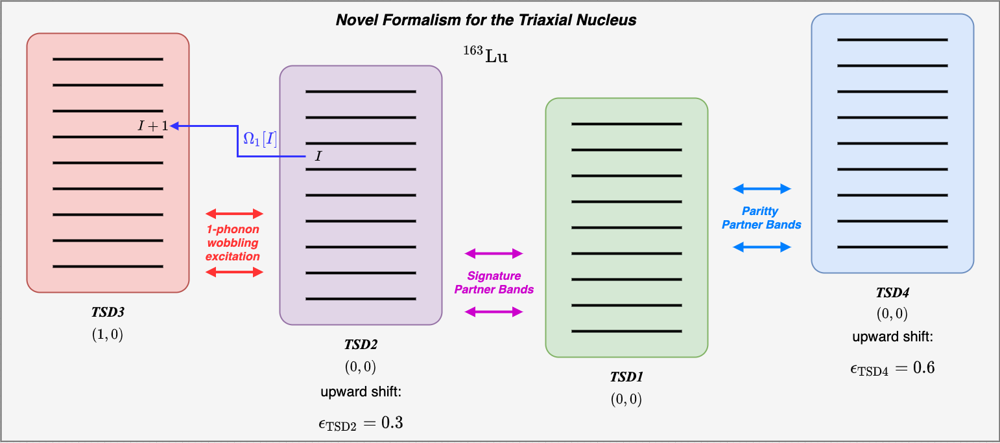
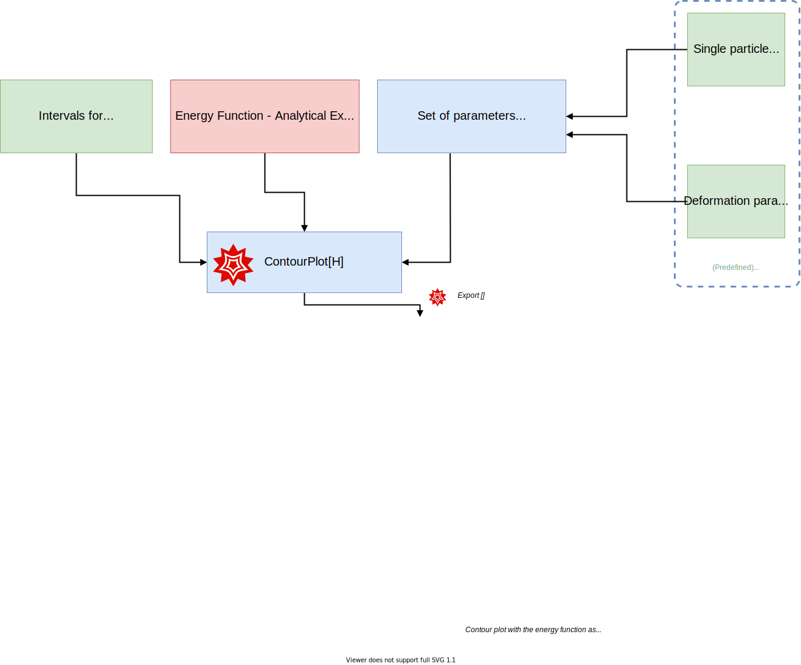

# $^{163}$Lu - Wobbling Motion & Energy Spectrum

Project dedicated to the wobbling motion in $^{163}$Lu aimed at describing the energy spectra of the four triaxially deformed bands, nuclear stability (e.g. shape transition, shape equilibrium) and wobbling regimes within a classical approach.

## Theoretical Aspects Regarding Wobbling Motion in $^{163}$Lu

Wobbling motion plays an important role in determining which nuclei have stable structures with very large deformation (e.g. high degree of asymmetry in their mass/charge distribution, large quadrupole moments, rich energy spectra and increased ratios between the moments of inertia - giving triaxial parameters with interesting values).

Being a unique fingerprint for identifying triaxial nuclei with strong deformation (phenomenon which helps the nuclear physics community in topics like fission barrier heights, proton emission probabilities, nucleon separation energies) it has become a very interesting topic for both experimentalists and theoreticians. However, understanding and obtaining a full picture for this effect is definitely now an easy task.

The present project aims at developing *a new approach in describing the nuclear properties of $^{163}$Lu* isotope (considered to be one of the best *wobblers* know so far). The features of wobbling motion (phenomenon strictly related to stability of highly deformed nuclear shapes) that are present in the nucleus under study have a strong experimental foundation, with excitation energies, transition probabilities, quadrupole moments and so on, determined within high degrees of accuracy. Based on an increasing number of contributions from the nuclear structure community, the concept of wobbling motion (with its main characteristics, features and physical significance) is an established phenomena from a theoretical standpoint, especially in the nuclear region $A\approx160$.

> Find an in-depth analysis of the project [here](Resources/Reports/Lu163_newFormalism.pdf)

The wobbling spectrum of $^{163}$Lu has four known wobbling bands (w.b.) which were confirmed experimentally, with well defined spins, energies and quadrupole moments (see a graphical representation below, taken from [here](https://www.nndc.bnl.gov/ensdf/EnsdfDispatcherServlet)). The available data for this nucleus can be accessed [here](Resources/Documentation/experimental_data_ensdf.pdf).
So far, the spectrum was regarded as having a standard *harmonic-like* structure, with a ground state band (a zero phonon mode of the nucleus) and three additional bands built on top of it (one, two and three-phonon modes of excitation). The nomenclature of this nucleus's wobbling structure is as follows:

* TSD1 is the yrast band, ground state for the wobbling spectrum, with the phonon wobbling numbers: $(n_{w_1},n_{w_2})=(0,0)$
* TSD2 is the 1-phonon band band, built on top of TSD1, with a spin sequence that has $\Delta I=2\hbar$:  $(n_{w_1},n_{w_2})=(1,0)$
* TSD3 is the second excited wobbling band (2-phonon w.b.): $(n_{w_1},n_{w_2})=(2,0)$
* TSD4 is the third excited w.b., built on top of TSD1 with three wobbling phonons: $(n_{w_1},n_{w_2})=(3,0)$

> This is the standard picture for the wobbling spectrum fo $^{163}$Lu nucleus, in which the concept of wobbling motion is described through phonon excitations that are used to build sequences of $\Delta=2\hbar$ spin states.

### The Wobbling Spectra of $^{163}$Lu

## Project Goals

Main goals of the present project are:

- [ ] Obtain the analytic formulas for the four **wobbling bands** in $^{163}$Lu.
- [ ] Define the free parameter set which enters in the energy formulas: $\mathcal{P}$.
- [ ] Implement methods for computing each energy band of the nucleus, then also compute root mean square error (`rms`) for the ***excitation energies***, based on the experimental data.

$$E_\text{RMS}=\sqrt{\frac{\sum(E_{exp}-E_{th})^2}{N}}$$
with $E_\text{th}$ being a numerical function (which should be implemented) that depends on the spins and the parameter set: $E=f(I,\mathcal{P})$.

- [ ] **August 2020 Novel Approach**: Instead of using the band structure described at the beginning, this project considers a new approach, which could prove to be more efficient tool for studying the wobbling motion. Description of this novel approach can be found below.
  * The theoretical model on which the approaches are based goes further than the present frameworks. Phenomena like *parity symmetry* and *signature splitting* could actually take place in the underlying physics of the shape structure of $^{163}$Lu.
  * Semiclassical manner of treatment is helping the theory due to its close contact with the motion of well know physical systems (e.g. rigid rotor, particle rotor model).
  * The mathematical framework that is developed towards obtaining the excited wobbling spectrum and transition probabilities encapsulates some interesting features (e.g. obtaining real solutions for non-hermitic Hamiltonians, wave-functions that neglect core-valence nucleon interaction).
- [ ] Implementation of a *search function*, which is looking for the best possible parameter set $\mathcal{P}_\text{best}$ that would provide minimal deviations of the excitation energies $E_\text{exc;TH}$ from the experimental ones.
- [ ] Search function should compute the `rms` for every interval of existence for the following *free parameters*:
  * Moments of inertia (w.r.t. the principal planes): $\mathcal{I}_1$, $\mathcal{I}_2$, $\mathcal{I}_3$.
  * Triaxiality parameter: $\gamma$.
  * The single particle potential strength: $V$.
  * The core-$\vec{j}$ coupling (valence particle + triaxially deformed even-even core) is consistent across all four bands: the valence proton (intruder) $\pi_{i;j=13/2}$ is the particle with couples to the deformed even-even core, driving the entire system up to large deformations, stable in their nature.
- [ ] Work with the ***excitation energies*** instead of the absolute energies: within the numerical algorithm, each energetic state in the spectrum will be subtracted from the ground state band of the yrast band (namely TSD1). More precisely, instead of working with an energy expression of the form $E_\text{TSDK}[I]$ (where K is 1,2,3, or 4 and $I$ is the corresponding angular momentum of the rotational state), the excitation energy $E_\text{TSDK}^\text{exc}[I]=E_\text{TSDK}-E_\text{TSD1}[13/2]$ is introduced.

## Novel Formalism in Obtaining the Wobbling Spectrum

### Understanding the nature of the band structure in $^{163}$Lu

As it was already mentioned, the nucleus is considered to have a harmonic-like structure for the four known wobbling bands (w.b.). The phonon numbers are increasing by one unit for each band (i.e. from 0 for TSD1, up to 3 for TSD4). However, it is important to mention that the fourth band is different from the other three, by the coupling scheme implied by the total system (core+particle). More precisely, the TSD4 band is has states that are excited due to the *coupling of the core with a different proton*: $\pi_{h;j=9/2}$ and as a result, this drives the system up to large deformations, with different quadrupole moments (in magnitude) but also negative parity (as opposed to the first three bands, where the parity is positive).

Large number of publications adopted this scheme in the theoretical formalism. Even our team developed work for reproducing the experimental results within semi-classical approaches using this formalism. (E.g. [this paper on the same isotope](https://journals.aps.org/prc/abstract/10.1103/PhysRevC.96.054320)). So far, it has been established that $^{163}$Lu is based on three excited wobbling-like bands and two different nucleon-core coupling take place in driving this to nuclear shapes with very large deformation.

However, one cannot know for sure if indeed this is the actual configuration for this isotope, since different frameworks use different concepts in describing the underlying physics that takes place when complex systems (like an even-odd nuclear body) is also under strong deformation effects, rotational motion up to very large spin and large asymmetry in the mass distribution. It is mandatory to ask ourselves if it is not possible that some other phenomena can take place at these properties. **This is the motivation for developing the current project**: the team is trying to provide an alternative view in the band structure of this nucleus, while keeping a consistent theory and give qualitative studies with regards to the relevant nuclear quantities.

> ⚠️  This project provides an unique description of the wobbling spectra in $^{163}$Lu, which has not been previously discussed, analyzed or even speculated. The developed description, which completely changes the way on how one considers the band structure to look like, while providing an overall agreement with the experimental results and a consistent physical model as framework.

### The Novel Formalism

In a previous work (i.e. [this](https://journals.aps.org/prc/abstract/10.1103/PhysRevC.101.014302) and [this](https://iopscience.iop.org/article/10.1088/1361-6471/ab5ae4/meta)), the team adopted a different view for the wobbling picture: in comparison with the classical band structure of $^{163}$Lu, this new approach uses the following formalism (extracted from the abstract of one of the papers):

> A new interpretation for the wobbling bands in the even-odd Lu isotopes is given within a particle-triaxial rotor semiclassical formalism. While in the previous papers the bands TSD1, TSD2, TSD3, and TSD4 are viewed as the ground, one, two, and three phonon wobbling bands, respectively, here the corresponding experimental results are described as: the ground band with spin equal to $I =R+ j$, for $R=0,2,4,...$ (TSD1), the ground band with $I = R + j$ and $R = 1, 3, 5, . . .$ (TSD2), the one phonon excitations of TSD2 (TSD3), with the odd proton moving in the orbit $j = i_{13/2}$, and the ground band of $I = R + j$, with $R = 1, 3, 5, . . .$ and $j = h_{9/2}$ (TSD4). The moments of inertia (MoI) of the core for the first three bands are the same, and considered to be free parameters. Due to the core polarization effect caused by the particle-core coupling, the MoI’s for TSD4 are different. The energies and the electromagnetic transitions are quantitatively well described. Also, the phase diagram of the odd system is drawn. In the parameter space, one indicates where the points associated with the fitted parameters are located, which is the region where the transversal wobbling mode might be possible, as well as where the wobbling motion is forbidden.

➡️  However, ***in the present model***, the team considers the same band structure as in the previously published work, but a new concept is introduced with regards to the triaxial bands TSD2 and TSD4: ***TSD2 and TSD4 are parity partner bands***.

Due to the parity symmetry nature of the two bands, the overall structure of the nucleus will have a consistent coupling $R+j$ across all four strongly deformed bands. That means that the odd proton $j=13/3$ is the only intruder which is moving in the quadrupole deformed mean field, generating the large deformation as a stable state.

### Parity symmetry in nuclei

Parity partner bands (i.e. in this formalism the bands TSD2 and TSD4) have:

* same spin sequences
* difference in the parity numbers

In the present case, TSD2 and TSD4 have indeed the same spin sequence, however their parity is opposite: TSD2 has $I^{+}$ positive parity spin states, while TSD4 has $I^{-}$ negative parity spin states.

The odd-particle movement in the nucleus is influenced by the core (quadrupole deformation and charge distribution). In the case of this nucleus, the even-even core has no spatial inversion invariance (no parity symmetry). This results in existence within the mean-field of both negative and positive parity states. The ground state $I=13/2$ level from the yrast band has a positive parity (since the TSD1 is a positive parity band) but due to the non-invariance of the core to the spatial inversion, there will be a difference in the energetic value of the excitation energy, when subtracting the band-head of TSD1 from any other states from the superior bands.

The diagram below explains the novel formalism that considers the concepts of parity symmetry breaking within TSD2&4 and also signature partner bands within TSD1&2.

### Understanding the coupling scheme of an even-odd triaxial nucleus

When compared to the literature, where there exist two intruders (i.e. two valence protons, one for TSD1,2,3 $=13/2$ and one for TSD4 $j=9/2$) that create an alignment with the angular momentum of a triaxially deformed even-even core, in this new formalism (novel approaches) it is speculated the fact that TSD4 keeps the same alignment particle but the core's angular momentum ($R$) is different (in the sense that the even-odd parity of the spin sequence changes). As a result, in these calculations and the overall framework, the proton $\pi_{i;j=13/2}$ is considered to be the single-particle $\vec{j}$ vector that aligns with the core $R$ (keep in mind that there are two core state sequences, namely one which corresponds to the bands TSD1&3: $R_{TSD1;3}$ and one that corresponds to the bands TSD2&4: $R_{TSD2;4}$).

Diagrams for the coupling schemes adopted in this project can be seen below.

#### The coupling scheme for the bands TSD1 and TSD3

#### The coupling scheme for the bands TSD2 and TSD4

⚠️ Some hand-written notes with the concepts of wobbling rotor and coupling can be found [here](Resources/Documentation/Wobbling_motion_general_concepts_regarding_coupling.pdf).

## Analysis of the potential strength parameter $V$

The *single particle potential strength* $V$ is graphically represented with respect to the triaxiality parameter $\gamma$.
Taking a fixed gamma in the fitting procedure, one finds the best set of parameters $\mathcal{I}_k,V$, for each $\gamma$ in the interval $[17,21]$.

According to WANG Shou-Yu et. al. (in the work *CHIN. PHYS. LETT. Vol.26,No .5 (2009) 052102*, the source is [here](Resources/Documentation/Wang_Shou-Yu_2009_Chinese_Phys._Lett._26_052102.pdf)), the single particle potential strength is related to the quadrupole deformation term $\beta_2$, and it is responsbile for the level splitting in the deformed field.

The fourth band has two possible formalisms in the analytic calculations (namely, a ground state band given by the phonon numbers $(0,0)$ and a 1-phonon excited band built on top of the yrast band $(1,0)$).

## Further Analysis With Regards to the Nuclear Stability of $^{163}$Lu

The nucleus is analyzed in terms of its critical points, or the regions where the deformed shapes exhibit certain properties (e.g. different wobbling regimes, axial symmetry, forbidden states). This addition is introduced in the following [issue](https://github.com/basavyr/163Lu-New-TSD4-Formalism/issues/5).

Some key concepts which are of interest for the overall topic are:

1. $\mathcal{H}(\theta,\varphi)$: The energy function of $^{163}$Lu - providing the classical energy expression for the isotope, approximated in the minimum points.
2. The critical points of the energy function
3. The extreme (**minimum**) points of the energy function across the $\theta - \varphi$ intervals.
4. Graphical representations with the evolution of the energy function w.r.t. a set of deformation parameters.

## Results

The following diagram gives an overview of the novel approach, and the concepts involved between each triaxial band in the $^{163}$Lu isotope.

### Contour plots with stable states (nuclear wobbling regimes)

A scheme for the algorithm for obtaining the contour plots for the triaxial isotope can be seen below.

<!-- ### Energy ellipsoids (trajectories of the rotational states) -->
