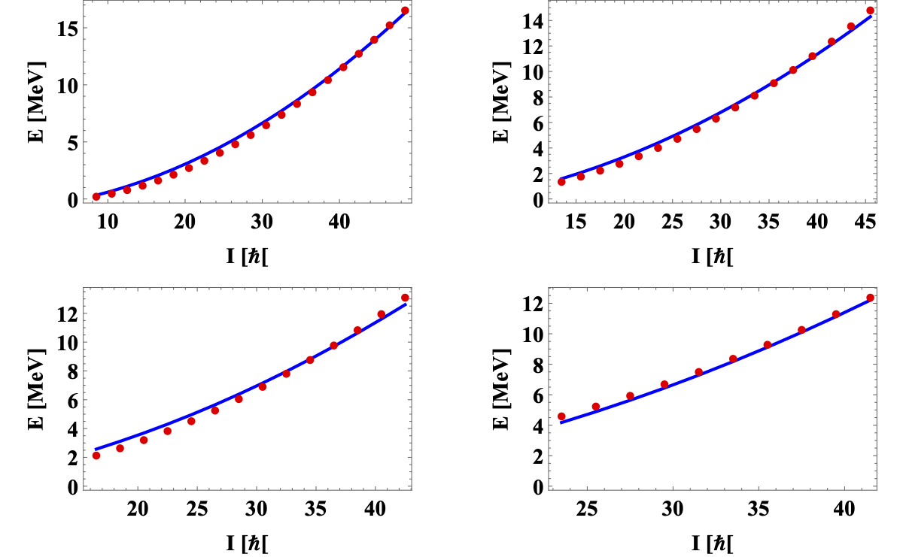
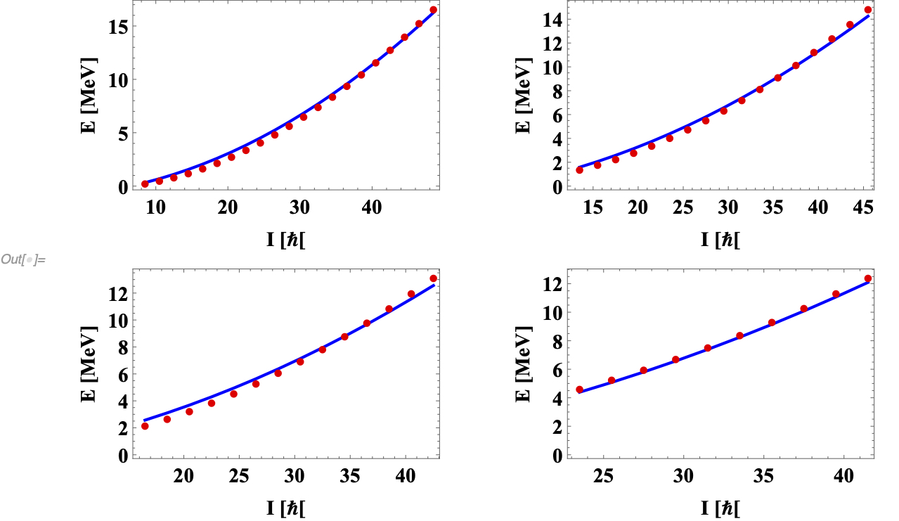

# $^{163}$Lu - new formalism for TSD4

The preliminary results of the fit for the excitation energies.

## Method 1

* TSD1: $(0,0)$, TSD2: $(1,0)$, TSD3: $(2,0)$, TSD4: $(0,0)$
* $j=13/2$

```
TSD4:  (0,0)
Initializing rms class...
Starting to search for the minimum RMS...
I1= 83.5
I2= 93.5
I3= 2
V= 9.1
gm= 21
E_RMS= 0.323061
Finished computations. Process took: 696.262 s
```

### Plot-0



## Method 2

* TSD1: $(0,0)$, TSD2: $(1,0)$, TSD3: $(2,0)$, TSD4: $(1,0)$
* $j=13/2$

```
TSD4:  (1,0)
Initializing rms class...
Starting to search for the minimum RMS...
I1= 84
I2= 94
I3= 2
V= 9.1
gm= 21
E_RMS= 0.313302
Finished computations. Process took: 567.621 s
```

### Plot-1

