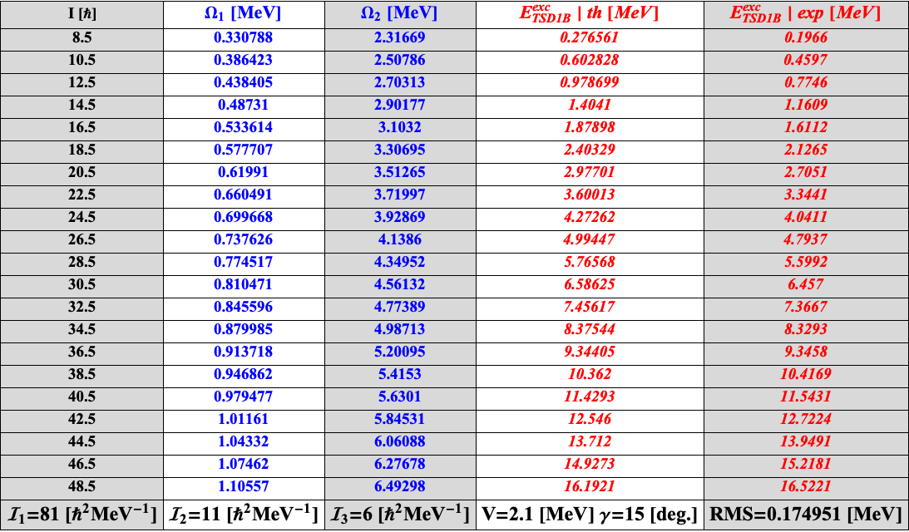
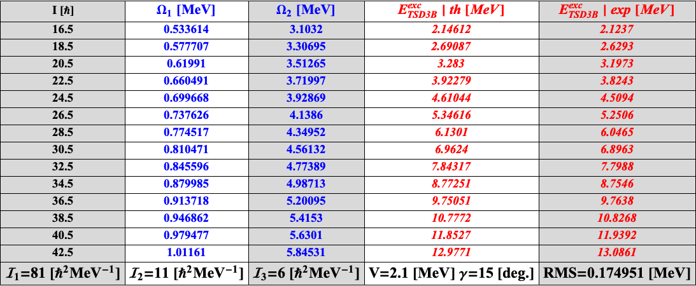

# Excitation Energies - Numerical Values

The **Mathematica** implementation for the calculus of $^{163}$Lu's wobbling energies also performs exports with the numerical data into a tabular view.

The relevant data are:

* Wobbling Frequencies (namely $\Omega_1$ and $\Omega_2$)
* Excitation energies (the Wobbling Energies - explicitly given below) for each band TSD1,2,3,4
* The Formalisms A and B are differentiated in the naming scheme of the fourth band (for the configuration $(0,0)$ the naming is `TSD400` while for $(1,0)$ is `TSD100`)

## Analytical Expression of the Wobbling Energy Associated to the Triaxial Nucleus

### Excitation Energy

In the fitting procedure, instead of working with the *wobbling energies*, the project adopts the so-called ***excitation energy***. The wobbling spectra for $^{163}$Lu is given in terms of the *absolute values*, that means each spin state is characterized by the corresponding wobbling energy. Excitation energy is obtained by subtracting from each level, the value of the first energy from the yrast band ($I_{TSD1}=13/2\equiv I_0$ denoted $E_0$). In the figure below, one can see that the excitation energy is given by the difference between the absolute value of the wobbling energy minus the reference one (that has the phonon numbers $(0,0)$ and depends on the same deformation parameters).

As a result, in both the C++  and Mathematica implementations, one must take care when computing the `rms` value of the wobbling spectrum, so it takes into consideration the necessary subtraction. Moreover, proper spin value $I_0$ and constant wobbling excitation numbers must be kept during the fitting processes.

Since the term of *absolute energies* was mentioned, it is useful to show the actual wobbling spectrum of the nucleus $^{163}$Lu.

## Mathematica Implementation

[Within the following update](https://github.com/basavyr/163Lu-New-TSD4-Formalism/commit/8d701c584b443be35d6dac9e04b18377b5d2253f), the project was extended with a Mathematica document which computes (for a given set of fitting-deformation parameters $\mathcal{P}$ and chosen formalism $A1-A2-B1-B2$) and outputs the wobbling frequencies and excitation energies, in a tabular view. Export function is properly declare to store the tables in the Resource project tree. Below, there are examples with the required tables.

### Phonon Frequencies and Excitation Energies for the Formalisms

#### The B formalism

