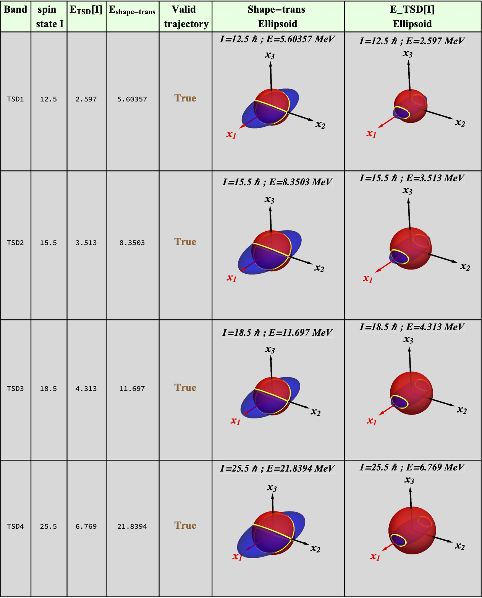

# $^{163}$Lu - Energy Ellipsoid

## Study the energy ellipsoids for all the triaxial states in $^{163}$Lu

The expression of the energy function is given in cartesian coordinates, and the expression consists in a rotational ellipsoid parametrized by the moments of inertia, the angular momentum of the state, and the energies.

With the rotational ellipsoid given, its intersection with the angular momentum sphere (with radius $R=I(I+1)$, where $I$ is the spin of a particular state) will produce the real trajectory of the triaxial system, around a particular axis (e.g. $x_1$, $x_2$ or $x_3$).

The size of ellipsoid will be given by $E$ (energy at which the ellipsoid equation is solved, for the set of parameters and the spin state).

In terms of the energy, one can have:

* trajectories that are non-physical (e.g. the ellipsoid is located inside the angular momentum sphere and outside)
* trajectories that are around the axis with the largest MOI, that is $x_1$, for energies that are within an interval $[E_{m}^0,E_{M}^0]$ (where the highest energy will produce rotations around the 1-axis, but very close to the poles of the angular momentum sphere)
* trajectories that are intersecting at the equator in a single point (during the rotation of the system, there is a bifurcation)
* trajectories that are taking place around a different axis: adjacent with the one that corresponds to the largest MOI (perpendicular). Within this case, the nuclear system undergoes a **shape transition**.

### Workflow

 - [ ] Find the energy interval that produces rotations around 1-axis.
 - [ ] Find the energy interval that results in non-physical trajectories.
 - [ ] Find the energy at which the system is rotating very close to the pole of the angular momentum sphere (a closed trajectory around $x_3$.)
 - [ ] Find the energy for a trajectory that is tangent with itself.

#### TSD1

* Energy at which the ellipsoid touches the sphere from the inside out -> 1.3399 (e1=-0.4) MeV
* Energy at which the ellipsoid touches the sphere from the outside (poles) -> 12.3299 (e1=10.59) MeV
* Energy at which the ellipsoid has the trajectories very close to each other (almost tangent), intersection taking place near the equator -> 5.5899 (e1=3.85) MeV
* Energy at which the the intersections are tangent (but rotation is changed to the $x_3$ axis) -> 5.6159 (e1=3.876) MeV

### Construct the geometry for a triaxial ellipsoid

The rotational nucleus will have trajectories given by the intersection between the angular momentum sphere and the energy ellipsoid. A point of interest is that where the system changes its rotational axis (e.g. the nucleus is doing a precession motion around $x_1$, then it changes to $x_3$ with increase in $E$ - for the same spin state). The energy at which a change in the rotational axis takes places is called the *shape-transition energy*. Its value can be analytically given if the equation $\frac{1}{c^2}=\sqrt{I(I+1)}$ (where $c$ is the semi-axis length of the energy ellipsoid).

Other points of interest (in terms of trajectories) are the ones that give the transition between the two wobbling states (i.e. 1-axis wobbling and 2-axis wobbling), and the ones that are near the two axes.

The table below shows the ellipsoid-sphere intersection, evaluated at two energies: the absolute energy corresponding to the spin-state within a TSD band, and the energy at which shape-transition takes place.

